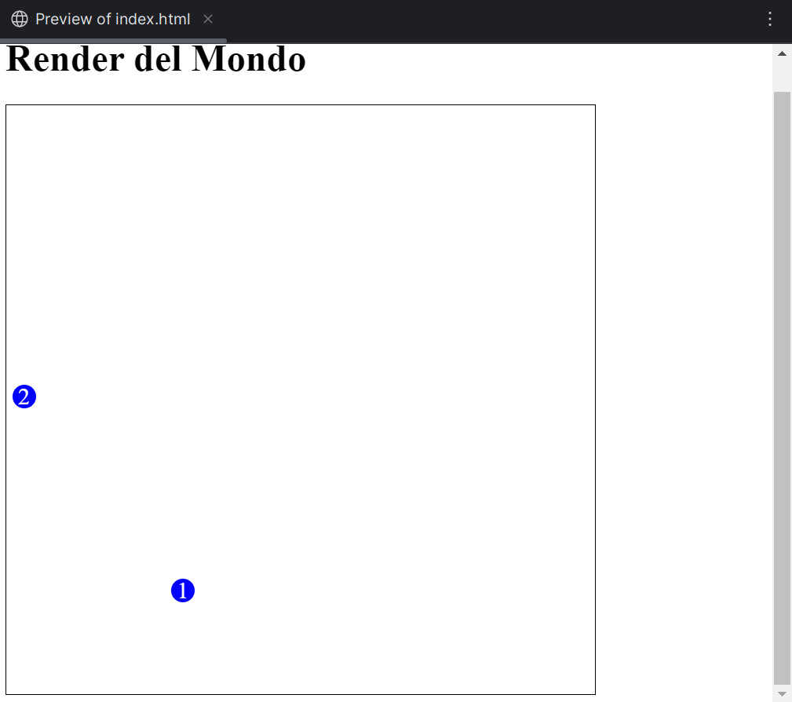
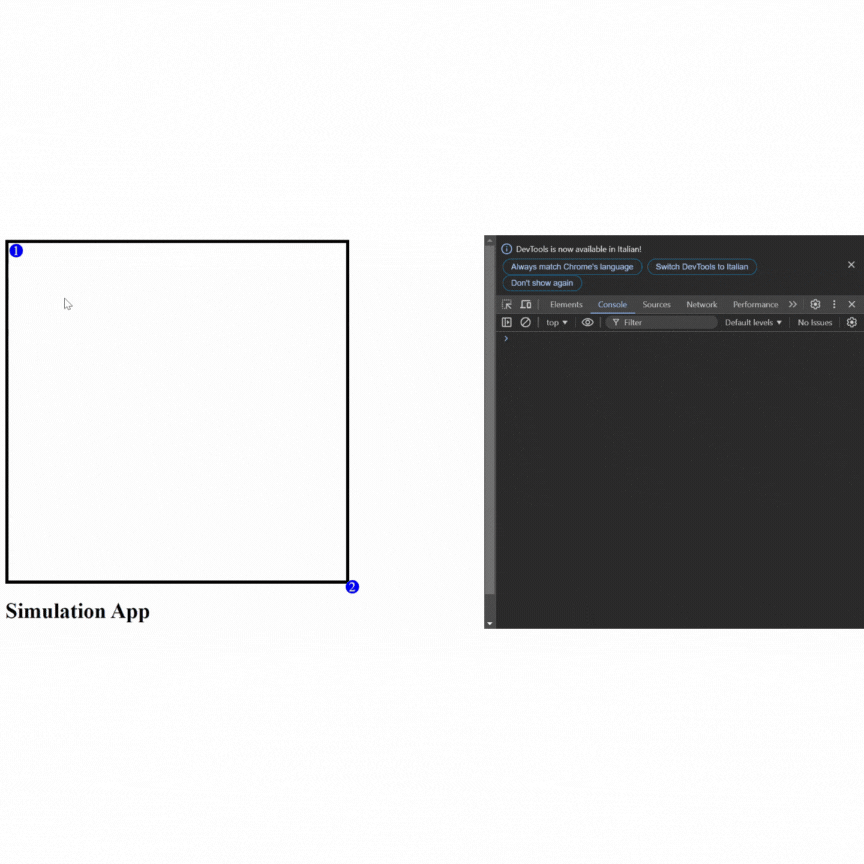

# Sprint backlog

## Sprint 0 - inizio 18/09/2024

### Sprint planning

> Lo Sprint iniziale sarà dedicato a un'analisi approfondita del problema, alla definizione dei requisiti del progetto e
> alla progettazione
> di una prima versione del design dell'applicazione. Parallelamente, procederemo con la creazione e configurazione
> della repository
> e dell'ambiente di sviluppo.
> L'obiettivo finale dello sprint è sviluppare una prima implementazione funzionante dell'architettura ECS.
> Considerata la natura delle attività previste, lavoreremo tutti e tre in stretta collaborazione durante questo sprint.
> Per questo sprint sono simate 2 settimane di lavoro
>

| **Product backlog item**                         | **Sprint task**                              | **Assignee** | **Status** |
|--------------------------------------------------|----------------------------------------------|--------------|------------| 
| **Configurazione del progetto**                  | Creare la Repository                         | Tutti        | Finito     |
|                                                  | Configurare l'ambiente di sviluppo           | Tutti        | Finito     |
|                                                  | Organizzare le prime dependencies            | Tutti        | Finito     |
|                                                  | Test automatici                              | Tutti        | Finito     |
| **Sviluppare l'architettura base del framework** | Ricerca ed analisi delle possibili soluzioni | Tutti        | Finito     |
|                                                  | Realizzazione implementazione di base        | Tutti        | Finito     |
| **Requisiti e specifica**                        | Requisiti di business                        | Tutti        | Finito     |
|                                                  | Requisiti modello di dominio                 | Tutti        | Finito     |
|                                                  | Requisiti funzionali                         | Tutti        | Finito     |
|                                                  | Requisiti di implementazione                 | Tutti        | Finito     |

### Review

> In questo primo sprint è stata fatta una ricerca approfondita sullo stato dell'arte relativo a questo genere
> di applicazione. La ricerca è stata necessaria per avere un'idea del funzionamento delle soluzioni già esistenti,
> dal punto di vista dei strumenti e delle architetture utilizzate.
> Lo studio effettuato ha indirizzato la scelta dell'architettura su un sistema basato su architettura ECS,
> i membri del gruppo hanno dunque approfondito la conoscenza di tale pattern per essere in grado di implementarlo.
> Allo stesso modo è stato valutato che per la view potrebbe essere conveniente utilizzare Laminar, tuttavia verrà
> studiato nel
> dettaglio e implementato solo in seguito.
> Sono stati configurati Scalafmt, per garantire uno stile uniforme nello sviluppo del progetto, e Scalatest.
> Il team ha creato un design architetturale di massima, con l'ausilio di diagrammi UML (in modo che si avesse una
> struttura solida) e implementato una versione base del core del progetto dove vengono definiti i componenti principali
> dell'ECS,
> ossia Entity, Components e Systems, ed un World con l'essenziale per gestire il tutto.
> L'implementazione si è svolta seguendo la metodologia TDD con una copertura del 100% sul codice sviluppato.
> Lo sprint si è concluso con la creazione di una simulazione di base che mostra il funzionamento di questa versione
> del core del framework..
> Siamo rimasti nei tempi definiti ad inizio sprint. Tuttavia, abbiamo riscontrato delle problematiche relative alla
> configurazione di Laminar.

#### Simulazione implementata

> La simulazione implementata consiste in due entità che si muovono a velocità costante, in caso di collisione le due
> entità si fermano.

``` 
Tick 1
Entity 1: Position(1.0, 1.0), Speed(1.0, 1.0)
Entity 2: Position(9.0, 9.0), Speed(-1.0, -1.0)
-------------------
Tick 2
Entity 1: Position(2.0, 2.0), Speed(1.0, 1.0)
Entity 2: Position(8.0, 8.0), Speed(-1.0, -1.0)
-------------------
Tick 3
Entity 1: Position(3.0, 3.0), Speed(1.0, 1.0)
Entity 2: Position(7.0, 7.0), Speed(-1.0, -1.0)
-------------------
Tick 4
Entity 1: Position(4.0, 4.0), Speed(1.0, 1.0)
Entity 2: Position(6.0, 6.0), Speed(-1.0, -1.0)
-------------------
Tick 5
Entity 1: Position(5.0, 5.0), Speed(1.0, 1.0)
Entity 2: Position(5.0, 5.0), Speed(-1.0, -1.0)
-------------------
Tick 6
Collision detected between Entity 1 and Entity 2
Entity 1: Position(5.0, 5.0), Speed(0.0, 0.0)
Entity 2: Position(5.0, 5.0), Speed(0.0, 0.0)
-------------------
Tick 7
Collision detected between Entity 1 and Entity 2
Entity 1: Position(5.0, 5.0), Speed(0.0, 0.0)
Entity 2: Position(5.0, 5.0), Speed(0.0, 0.0)
-------------------
Tick 8
Collision detected between Entity 1 and Entity 2
Entity 1: Position(5.0, 5.0), Speed(0.0, 0.0)
Entity 2: Position(5.0, 5.0), Speed(0.0, 0.0)
-------------------
Tick 9
Collision detected between Entity 1 and Entity 2
Entity 1: Position(5.0, 5.0), Speed(0.0, 0.0)
Entity 2: Position(5.0, 5.0), Speed(0.0, 0.0)
-------------------
Tick 10
Collision detected between Entity 1 and Entity 2
Entity 1: Position(5.0, 5.0), Speed(0.0, 0.0)
Entity 2: Position(5.0, 5.0), Speed(0.0, 0.0)
-------------------
```
## Sprint 1 (2/10/2024)

### Sprint planning

> Nel primo sprint ufficiale ci concentreremo sull'iniziare a pensare come migliorare le prestazioni del core, come
> implementare un
> DSL di base per il core sviluppato nello sprint precedente e le possibili soluzioni per implementare la view grafica
> tramite Laminar.
> Per questo sprint ci prefiggiamo di iniziare gli item del backlog, completando almeno uno o più sprint task in modo
> tale da avere una visione più concreta
> su quello che sarà il framework finale. La durata prevista di questo sprint è quindi di una settimana.

| Product backlog item                                                | Sprint task                             | Assignee | Status      |
|---------------------------------------------------------------------|-----------------------------------------|----------|-------------|
| Studiare un modo per implementare la GUI                            | Studiare Laminar                        | Giannini | Iniziato    |
|                                                                     | Fare test implementativi                | Giannini | Finito      |
|                                                                     | Realizzare implementazione di base      | Giannini | Iniziato    |
| Come utente voglio poter definire la mia simulazione con semplicità | Definire DSL per il core base           | Vasiliu  | Iniziato    |
|                                                                     | Definire DSL per la view                | Vasiliu  | Da iniziare |
|                                                                     | Definire DSL per core avanzato          | Vasiliu  | Da iniziare |
| Migliorare il nucleo del framework                                  | Introdurre test di performance          | Bennici  | Iniziato    |
|                                                                     | Ricerca ed analisi dei possibili design | Bennici  | Iniziato    |
|                                                                     | Implementazione delle migliorie         | Bennici  | Da iniziare |

### Review

> In questo secondo sprint abbiamo iniziato a lavorare, in modo disgiunto, all'implementazione vera e propria del progetto,
> portando avanti in parallelo il core, il DSL e la view.  
> [core] -> Si è iniziato a lavorare sul miglioramento del core del framework, con particolare attenzione alle performance.
> Sono stati introdotti benchmark di base ed è stato individuato un possibile design architetturale.
> L'effettiva implementazione dello stesso, ancora incompleta, verrà riproposta nello sprint successivo.  
> [DSL]  -> È stato fatto da prima uno studio di quale poteva essera la sintassi del DSL prendendo in considerazione
> implementazioni esistendi di DSL. Dopo aver valutato sintassi come ad esempio "obj method param" o "method {param}",
> la scelta è ricaduta su una sintassi del tipo "method(param1, param2).method2(param1, param2)" in quanto valutata più
> coerente e con un'implementazione più semlice. Lo studio e la valutazione delle varie implementazioni hanno richiesto
> più tempo del previso, rimane quindi incompleta la task "Definire DSL per il core base". Nel prossimo sprint verrà scritta
> la logica per implementare il DSL anche per utilizzare i system e verrà riscritta la simulazione utilizzando il DSL implementato.   
> [view] -> È stato fatto uno studio su come implementare Laminar al progetto, inserendo le dependencies in modo tale
> che non interferiscano con la parte del core in quanto nello sprint precedente avevamo notato che le 
> dipendenze relative a JS interferivano con scalatest impendendo di eseguire i test. 
> Una volta fatto ciò è stato rifinito il file HTML necessario per l'esecuzione della view.
> È stata introdotta un'implementazione di base per verificare l'effettivo funzionamento del modulo view e, in seguito, è
> stata strutturata un'architettura essenziale che permetta di renderizzare la logica delle simulazioni definita nel modulo "examples".
> L'implementazione di base è ancora incompleta e sarà il punto di partenza dello Sprint 2.

#### Simulazione implementata

> La simulazione implementata consiste nella visualizzazione del world con due entità statiche posizionate in modo randomico  
> Lo scopo era verificare la corretta implementazione di Laminar all'interno del progetto.


## Sprint 2 (9/10/2024)

### Sprint planning

> Nel secondo sprint continuiamo le attività rimanenti dal primo sprint.
> Si inizierà a ragionare sull'integrazione della view con la logica del core e del DSL.
> Verranno fatti dei refactor del codice per eliminare riddondanze per quanto rigarda component e system comuni in modo
> tale da semplificare la scrittura dei test e per fornire all'utente finale un set di strumenti per definire simulazioni
> base. Tali strumenti potrebbero essere utilizzati successivamente per la scrittura delle simulazioni di esempio.
> La durata prevista di questo sprint è di una settimana.


| Product backlog item                                                | Sprint task                             | Assignee | Status      |
|---------------------------------------------------------------------|-----------------------------------------|----------|-------------|
| Studiare un modo per implementare la GUI                            | Studiare Laminar                        | Giannini | Iniziato    |
|                                                                     | Realizzare implementazione di base      | Giannini | Finito      |
|                                                                     | Integrare JCEF                          | Giannini | Iniziato    |
| Come utente voglio poter definire la mia simulazione con semplicità | Definire DSL per il core base           | Vasiliu  | Finito      |
|                                                                     | Definire DSL per la view                | Vasiliu  | Da iniziare |
|                                                                     | Definire DSL per core avanzato          | Vasiliu  | Da iniziare |
| Migliorare il nucleo del framework                                  | Ricerca ed analisi dei possibili design | Bennici  | Finito      |
|                                                                     | Implementazione delle migliorie         | Bennici  | Iniziato    |

### Review

> In questo sprint abbiamo continuato a lavorare ai task iniziati nello sprint precedente.  
> [core] -> Viene confermato il design individuato nello sprint precedente. L'implementazione rimane in fase di
> finalizzazione, dunque riproposta nello sprint successivo.  
> [DSL] -> Il DSL per il core base è stato portato a termine, finendo di implementare la logica per utilizzare i system.
> Inoltre i test sono stati riscritti per essere più chiari e il codice è stato rifinito per essere condiderato "done".  
> [view] -> Durante questo sprint mi sono concentrato sul integrare la view con i moduli core ed examples.
> Lo sprint non è stato infruttuoso a causa di errori di compilazioni dovute alle dipendenze del core. Il problema dipende 
> dal fatto che view ed examples sono strutturati in modo tale da essere compilata da JS ed eseguiti su browser; il core 
> invece dipende unicamente dalla JVM e il codice scritto non viene interpretato correttamente in fase di compilazione.
> La soluzione più efficace dovrebbe essere creare il modulo core come se fosse un crossproject. 
> In questa fase ho però preferito non toccare il file build e creare un package in view riscrivendo il core in laminar;
> in questo modo ho potuto verificarne la correttezza. Al termine dello sprint ho iniziato a studiare come implementare 
> JCEF.


#### Simulazione Implementata tramite DSL
``` scala
private val world = World()

def initializeWorld(): Unit =
    into(world).spawnNewEntityWith(Position(0, 0), Speed(1, 1))
    into(world).spawnNewEntityWith(Position(10, 10), Speed(-1, -1))
    
    into(world).includeSystem(PrintPositionAndSpeedOfEntitiesSystem())
    into(world).includeSystem(CollisionSystem())
    into(world).includeSystem(MovementSystem())

def start(): Unit =
    initializeWorld()

for tick <- 1 to 10 do
  println(s"Tick $tick")
  update(world)
``` 
#### Simulazione Implementata per la view (feature/view)

## Sprint 3 (16/10/2024)

### Sprint planning

> Durante questo terzo sprint ci prefiggiamo di finire il core avanzato del framework e continuare lo sviluppo della view. Parallelamente inizieremo a pensare
> quali simlazioni d'esempio andremo a realizzare e come realizzare i report che tali simulazioni dovranno avere.
> L'obiettivo di questo sprint è quindi avere gli strumenti per realizzare una simulazione di prova del framework.


| Product backlog item                                                                            | Sprint task                             | Assignee | Status      |
|-------------------------------------------------------------------------------------------------|-----------------------------------------|----------|-------------|
| Implementare la GUI                                                                             | Studiare Laminar                        | Giannini | Iniziato    |
|                                                                                                 | Modificare il core -> CrossProject      | Giannini | Iniziato    |
|                                                                                                 | Integrare JCEF                          | Giannini | Iniziato    |
|                                                                                                 | Aggiungere le varie funzionalità        | Giannini | Iniziato    |
| Come utente voglio aver accesso a simulazioni d'esempio preprogrammate utilizzando il framework | Pensare le possibili simulazioni        | Vasiliu  | Finito      |
|                                                                                                 | Progettare le simulazioni               | Tutti    | Iniziato    |
|                                                                                                 | Implemetare le simulazioni              | Tutti    | Da iniziare |
| Come utente voglio avere un report dell'andamento della simulazione                             | Progettare come realizzare il report    | Vasiliu  | Iniziato    |
| Migliorare il nucleo del framework                                                              | Implementazione delle migliorie         | Bennici  | Iniziato    |


### Review
 
> [core] -> L'implementazione è completa ma non ancora done.  
> [simulazioni] -> Sono state pensate le simulazioni di esempio per il framework e abbiamo iniziato a progettarle.  
> [view] -> In questo sprint l'avanzamento della view ha visto la possibilità di inserire il numero delle entità, tuttavia la 
> configuraione dei parametri è ancora indietro. Il non avanzamento in questo sprint non è dovuto a difficoltà o imprevisti relativi
> al progetto.
## Sprint 4 (23/10/2024)

### Sprint planning

> In questo sprint ci prefiggiamo di terminare la parte relativa alla view, implementare il prototipo di simulazione. Parallelamente finiremo di progettare le simulazioni 
> di esempio e finiremo di implementare la logica per realizzare il report.


| Product backlog item                                                                                         | Sprint task                               | Assignee | Status      |
|--------------------------------------------------------------------------------------------------------------|-------------------------------------------|----------|-------------|
| Implementare la GUI                                                                                          | Studiare Laminar                          | Giannini | Iniziato    |
|                                                                                                              | Modificare il core -> CrossProject        | Giannini | Finito      |
|                                                                                                              | Integrare JCEF                            | Giannini | Iniziato    |
| Come utente voglio poter configurare i parametri della mia simulazione (anche) tramite GUI prima di avviarla | Sistema per definire i parametri          | Giannini | Iniziato    |
|                                                                                                              | Logica per passare i parametri alla view  | Bennici  | Iniziato    |
| Come utente voglio poter definire la mia simulazione con semplicità                                          | Definire DSL per core avanzato            | Vasiliu  | Finito      |
| Come utente voglio aver accesso a simulazioni d'esempio preprogrammate utilizzando il framework              | Progettare le simulazioni                 | Tutti    | Da iniziare |
|                                                                                                              | Implemetare le simulazioni                | Tutti    | Da iniziare |
| Come utente voglio avere un report dell'andamento della simulazione                                          | Progettare come realizzare il report      | Vasiliu  | Iniziato    |
| Migliorare il nucleo del framework                                                                           | Implementazione delle migliorie           | Bennici  | Finito      |


### Review

> [DSL] -> Il DSL per il core avanzato è stato portato a termine, migliorandolo rispetto al DSL precendente.  
> [simulazione] -> Abbiamo iniziato a pensare alla logica per passare i parametri alla view, progettando le strutture dati che conterranno i parametri e i dati per il report e
> per l'andamento che saranno passati alla view.  
> [view] -> Durante la settimana è stata aggiunta una nuova classe per definire (Nel modo più generico possibile, in modo da lasciare completa libertà all'utente) i parametri della simulazione.
> Allo stesso modo anche un oggetto che, leggendo la lista di parametri da settare renderizza sotto forma di lista compilabile i vari parametri ed effettua un controllo sulla validità
> del dato inserito. 
> 
> Non sono stati raggiunti tutti gli obiettivi prefissati a causa di rallentamenti causati da impegni relativi ai corsi, ma ci siamo portati al punto da avere tutti gli strumenti
> per raggiungere gli obbiettivi prefissati (View per definire i parametri, pseudocodice per simulazioni e sistema per report).

## Sprint 5 (30/10/2024)

### Sprint planning

> In questo sprint ci prefiggiamo di implementare il prototipo di simulazione e scrivere le simulazioni d'esempio. 
> Parallelamente finiremo di implementare la logica per realizzare il report.
> Più precisamente
> * intendiamo integrare la view con il core in modo tale da visualizzare il prototipo di simulazione e terminare il sistema per definire i parametri
> della simulazione.
> * finire di progettare le simulazioni, definendo come realizzare i system
> * continuare a lavorare alla logica per realizzare il report finale e iniziare a realizzare la logica per visualizzare l'andamento della simulazione


| Product backlog item                                                                                          | Sprint task                              | Assignee  | Status       |
|---------------------------------------------------------------------------------------------------------------|------------------------------------------|-----------|--------------|
| Implementare la GUI                                                                                           | Studiare Laminar                         | Giannini  | Iniziato     |
|                                                                                                               | Integrare JCEF                           | Giannini  | Iniziato     |
| Come utente voglio poter configurare i parametri della mia simulazione (anche) tramite GUI prima di avviarla  | Sistema per definire i parametri         | Giannini  | Iniziato     |
|                                                                                                               | Logica per passare i parametri alla view | Bennici   | Iniziato     |
| Come utente voglio aver accesso a simulazioni d'esempio preprogrammate utilizzando il framework               | Progettare le simulazioni                | Tutti     | Da iniziare  |
|                                                                                                               | Implemetare le simulazioni               | Tutti     | Da iniziare  |
| Come utente voglio avere un report dell'andamento della simulazione                                           | Progettare come realizzare il report     | Vasiliu   | Iniziato     |
| Come utente voglio sapere come sta evolvendo la simulazione                                                   | Progettare la logica                     | Vasiliu   | Da iniziare  |


